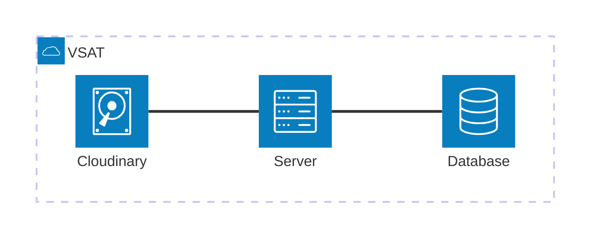
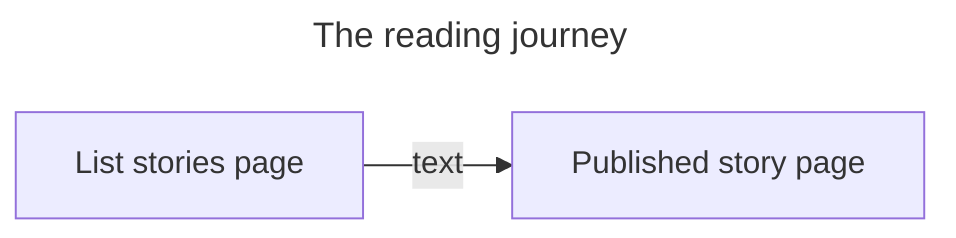
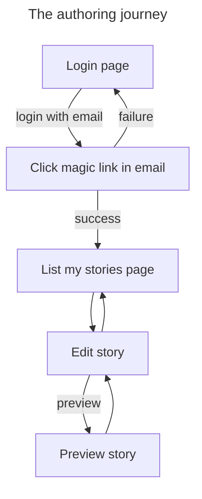

VSAT is a monolithic application codebase comprising:

* an [Express](https://expressjs.com/) web server
* API routes used by the client-facing pages are handled by Express
* [Astro](https://astro.build/) handles the client-facing pages
* [React](https://react.dev/) is used for the client-side interactivity

> * [The key files](./key-files.md) describes the most important files in the
> codebase.
> * Check out [the story domain](./domain.md) docs.

# Structure

> ℹ️ Diagrams created using
> [Mermaid](https://docs.github.com/en/get-started/writing-on-github/working-with-advanced-formatting/creating-diagrams).

# Journeys

There are two user journeys through the application:

* a _reading_ journey where a user reads stories.
* an _authoring_ journey where a user writes one or more stories.

## Reading

* starts on the [list of stories page](/src/pages/story/index.astro): from here
  a user can browse all _published_ stories, clicking on a story to read it.
* each _published_ story is served by
  [this single page](/src/pages/story/[storyId]/index.astro) which displays an
  [AFrame](https://aframe.io/) scene.

The code for the AFrame scene is in
[PublishedStory](/src/components/story/published/PublishedStory.astro).

## Authoring

* the authoring journey starts on
  [the login page](/src/pages/login/index.astro): VSAT needs to know who the
  author is so that it can attribute the story to the author.
* after successfully authenticating, the user — hereafter _author_ — lands on
  their [author homepage](/src/pages/author/story/index.astro) which lists all
  of the stories that they are authoring.
