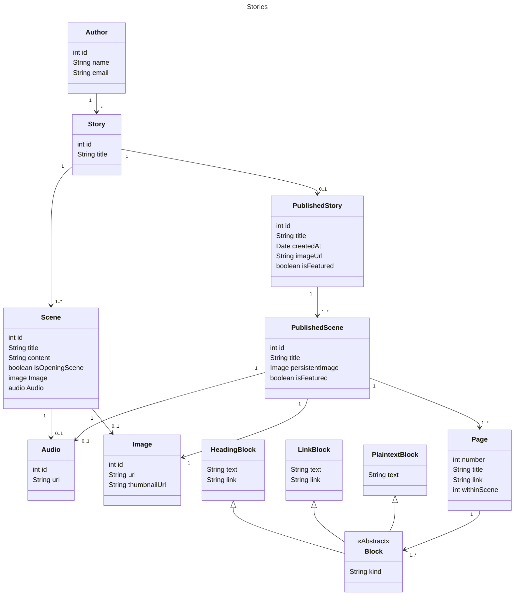

VSAT revolves around authoring and reading stories.

Users who write stories are authors. Users who read stories are readers. A user
can be both an author and a reader.

The stories are interactive fiction: a _story_ has an opening _scene_ which will
have one or more _exits_ (links) to other scenes.

Each scene will have some _content_ -- the text describing the scene -- and a
panoramic image that serves as the backdrop for the scene. A scene may
optionally also have some audio such as background music or narration.

A story can only have one author and only that author can edit, publish, or
delete that story. A login is required to author stories.

An author can work on as many stories as they like at any time. A story isn't
available to readers until it is _published_. Once published, the story will
appear on the site's list of stories and anyone can read it. (No login is
required to read stories.)

Editing a story that's been published doesn't change the published version; to
see the latest edits to a storythe story needs to be republished. (Currently
there's no versioning of published stories so republishing a story overwrites
the previously published version.)

## Content

Here's an example of the text content for a single scene.

```
# The Grand Opening

Mark entered the Sackler.

To his right are shelves of books.

To his left he sees Lucy, his colleague.

* [Mark's eye is caught by a book](thebookshelves)
* [Chat with Lucy](the erudite colleague)

# The Accursed Book|thebookshelves

There are many valuable books to borrow, including von Junzt's Unaussprechlichen
Kulten.

# The Erudite Colleague

Lucy's knowledge of Akkadian is peerless.
```

This single scene comprises:

* three _pages_.
* with _links_ from the first page to the other pages.

The pages are delimited by the headings: opening a new heading creates a new
page. (And implicitly ends any preceding page.)

The first page has the following state:

* the `title` is _The Grand Opening_.
* there are a few lines of plain text.
* there are two _links_ that link to other pages within the same scene.

Links are written in a
[Markdown-like](https://www.markdownguide.org/basic-syntax/#links) format:

```markdown
[the text to be displayed](the target)
```

The target is always going to be another heading:

* either the heading of another page in the same scene.
* or the the heading of another page in a different scene.

In the case of the example story, we have the following link:

```
[Mark's eye is caught by a book](thebookshelves)
```

* the link's `text` is _Mark's eye is caught by a book_
* the link's `target` is _thebookshelves_.

When the story is being read there'll be some UI affordance that makes the
link's text clickable or otherwise actionable. When clicked, the UI will
transition to the page associated with the target of _thebookshelves_.

In the example story there is a page with the target ID of `thebookshelves`:
this was created by the following heading:

```
# The Accursed Book|thebookshelves
```

Headings are also written in a Markdown-like format:

```markdown
# The text of the heading | the target ID
```

> ℹ️ Note that, unlike in Markdown, there is only a single level of heading.

In the case of our heading from the example story, the heading parses to:

* the `text` is _Mark's eye is caught by a book_
* the heading's `id` is _thebookshelves_.

The `id` is optional: if absent the `id` is derived from the `text`; in the case
of our heading from the example story, the derived `id` would be:

```
the-bookshelves
```

## Types


